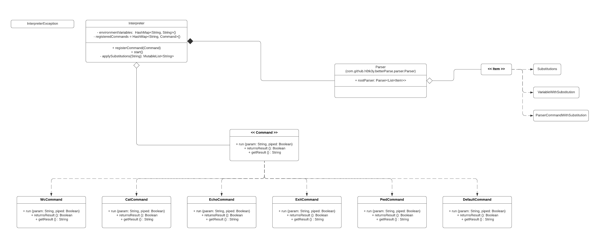

# HW1

## Диаграмма классов

## Текстовое описание архитектуры
Существует главный класс `Interpreter`, который получает на вход команды пользователя и выводит ему обратно результат. 

Этот класс создаёт экземпляр класса `Parser`, который является парсером, реализованным с помощью инструментов библиотеки [better-parse](https://github.com/h0tk3y/better-parse#grammar).

Каждый токен, который является реализацией интерфейса `Item`, по-своему обрабатывается в `Interpreter`: например когда он понимает, что это токен команды, то есть класс `ParserCommandWithSubstitution`, то он пытается найти такую команду среди известных ему и, если у него получилось, то он её вызовет. Иначе он попытается запустить эту команду через системный интерпретатор командной строки, с помощью класса `DefaultCommand`. 

Чтобы добавить свою команду в интерпретатор надо реализовать класс, который будет реализовывать интерфейс `Command`.
Затем перед запуском интерпретатора методом `run` надо добавить эту команду в интерпретатор вызовом метода `registerCommand`, первым параметром которого идёт имя команды, какое вы будете использовать в интерпретаторе, а вторым параметром надо передать инстанс вашего класса команды.
